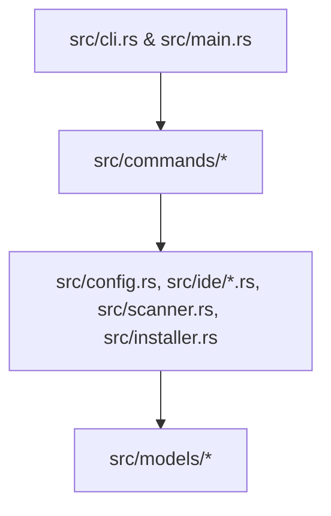
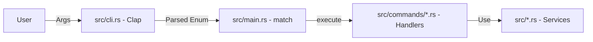
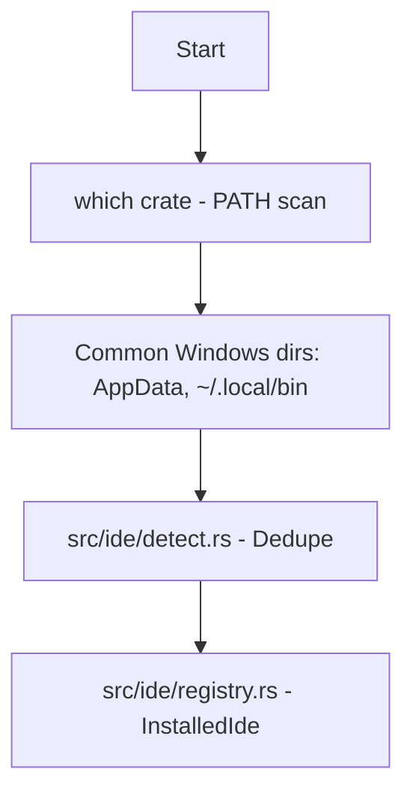
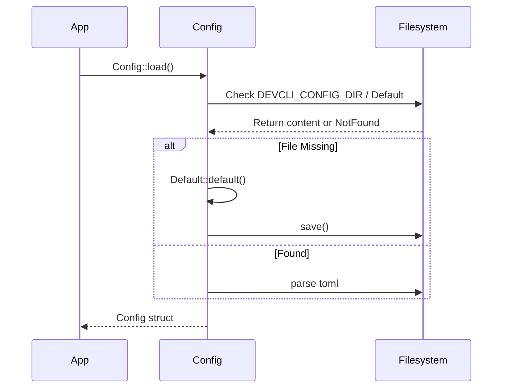
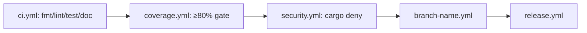

# Architecture Diagrams

This file contains the detailed visual documentation for the `dev-cli` architecture.

## Overview & Layered Architecture

For the high-level system overview, see [architecture.md](architecture.md).

The following diagram illustrates the strict layered dependency direction (no upward imports):

## Command Dispatch Flow

When a user executes a command, it follows this path:

## IDE Detection Pipeline

The detection logic runs multi-stage detection:

## Config Lifecycle

The configuration is managed with a "load-or-create-defaults" pattern:

## CI Pipeline

Automated workflows ensure code quality, coverage, and security:

## How to Keep This Current

- **Adding/Renaming Modules:** If you create a new module, update the **Layered Architecture** diagram if it introduces a new service or model, or the **Command Dispatch Flow** if it is a new command handler.
- **Dependency Changes:** If you add a cross-layer dependency, ensure it complies with the layering rules, and update the **Layered Architecture** diagram if necessary.
- **Cross-references:** Keep these diagrams synchronized with the module descriptions in [modules.md](modules.md) and the dependency graph in [dependency-map.md](dependency-map.md).
- **Validation:** When modifying, verify that the module paths in the diagrams match the actual file structure in the `src/` directory.
