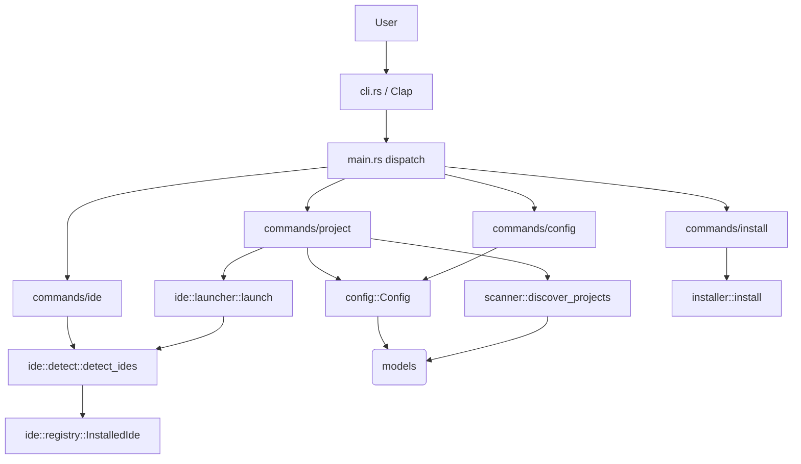

# Architecture

> Living summary of the `dev-cli` architecture. Source of truth is `ARCHITECTURE.md` and the code itself; this file is the condensed AI-facing view. **Update when the module graph, layer rules, or command flow changes.**

## Overview

`dev-cli` is a Windows-first Rust CLI that discovers Git repositories under configured roots and launches them in a detected IDE. It follows a strict 4-layer architecture with **no upward dependencies**.

```
main.rs ─────────────► commands/* ────────► services ──────────► models/*
  │                        │                   │                   ▲
  └── cli.rs (parse) ──────┘                   └──► models ────────┘
```

- **Layer 1 — CLI** (`src/cli.rs`, `src/main.rs`): Clap parsing + dispatch. No business logic.
- **Layer 2 — Commands** (`src/commands/`): orchestrate services, format output, user-facing errors.
- **Layer 3 — Services** (`src/config.rs`, `src/ide/`, `src/installer.rs`, `src/scanner.rs`): business logic + system interaction.
- **Layer 4 — Models** (`src/models/`): `Ide` enum, `Project` struct. No service dependencies.

## Module Map

| Module | Responsibility | Key types/functions |
|--------|---------------|---------------------|
| `src/main.rs` | Entry point, dispatch | `main()` |
| `src/cli.rs` | Clap arg definitions | `Cli`, `Commands`, `*Command`, `*Args` |
| `src/commands/project.rs` | `dev project list/open`, `dev open` | `execute`, `open`, `list_projects`, `open_shortcut` |
| `src/commands/config.rs` | `dev config init/show/set-default-ide` | `execute` |
| `src/commands/ide.rs` | `dev ide list` | `execute`, `list` |
| `src/commands/install.rs` | `dev install` | `execute` |
| `src/config.rs` | Config load/save/path | `Config`, `Config::load/save/path` |
| `src/ide/detect.rs` | IDE discovery (PATH → Windows paths) | `detect_ides` |
| `src/ide/launcher.rs` | Spawn IDE processes | `launch` |
| `src/ide/registry.rs` | Detected IDE type | `InstalledIde` |
| `src/installer.rs` | Global install to `~/.local/bin` | `install`, `binary_install_dir` |
| `src/scanner.rs` | Recursive `.git` discovery | `discover_projects` |
| `src/utils/path.rs` | Path display helpers | `display_path` |
| `xtask/` | Dev tooling (`cargo xtask ci/coverage`) | `ci`, `step`, `coverage_step` |

## Command Dispatch Flow

```
User → `dev config show`
  → Cli::parse()                 (clap)
  → main.rs match Commands::Config
  → commands::config::execute(ConfigCommand)
  → Config::load()               (reads config.toml)
  → prints {:#?} of Config
```

Every handler returns `anyhow::Result<()>`; `?` propagates errors up to `main` (the binary's `main` returns `Result<()>`).

## Data Flow — `dev open <name>`

```
open(args) 
  → Config::load()
  → scanner::discover_projects(&config.projects_root)   // Vec<Project>
  → find project by name (bail! if missing)
  → ide = args.ide.unwrap_or(config.default_ide)
  → launcher::launch(ide, &project.path)                // spawn, don't wait
  → print "Opened <path>"
```

## IDE Detection Pipeline

1. **PATH scan** — `which` crate for `code`, `cursor`, `claude`, `wt`.
2. **Windows common locations** — `AppData/Local/Programs/Microsoft VS Code/bin/code.cmd`, `.../Cursor/Cursor.exe`, `~/.local/bin/claude.exe`.
3. **Dedupe** — skip adding if the same `Ide` variant already found.

Launcher maps per IDE: VS Code/Cursor/others → `exe <project>`; Claude → `current_dir(project)`; Windows Terminal → `wt -d <project>`. A `DEVCLI_TEST_EXECUTABLE` env override bypasses detection for tests.

## Config Lifecycle

- `Config::path()` honours `DEVCLI_CONFIG_DIR` (test override) else platform config dir via `directories`.
- `load()`: creates + saves defaults if file missing.
- Schema: `projects_root: Vec<PathBuf>`, `default_ide: Ide`.
- Fresh load each invocation (no cross-command caching).

## Design Invariants

1. **No upward imports** — `models` never imports services/commands; services never import commands.
2. **Result everywhere** — fallible ops return `anyhow::Result`; `.context()` for clarity.
3. **No `unwrap()` in production** (except documented init, e.g. `BaseDirs::new().expect(...)` in `Config::default`).
4. **Docs with code** — every public API has rustdoc; see `.claude/DOCUMENTATION-MAINTENANCE.md`.
5. **Module size** — target 200–300 lines, hard cap 500 before splitting.
6. **Tests with features** — unit tests in-source, integration tests in `tests/`.

## Mermaid Overview


