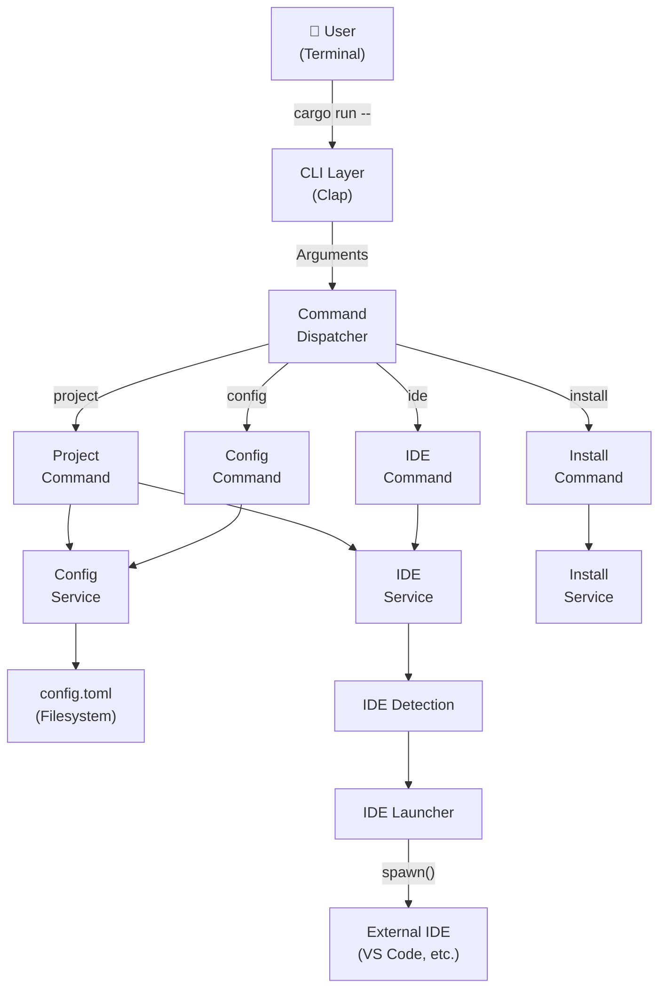
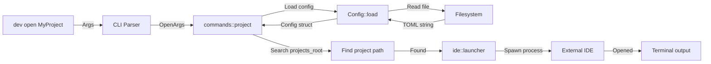
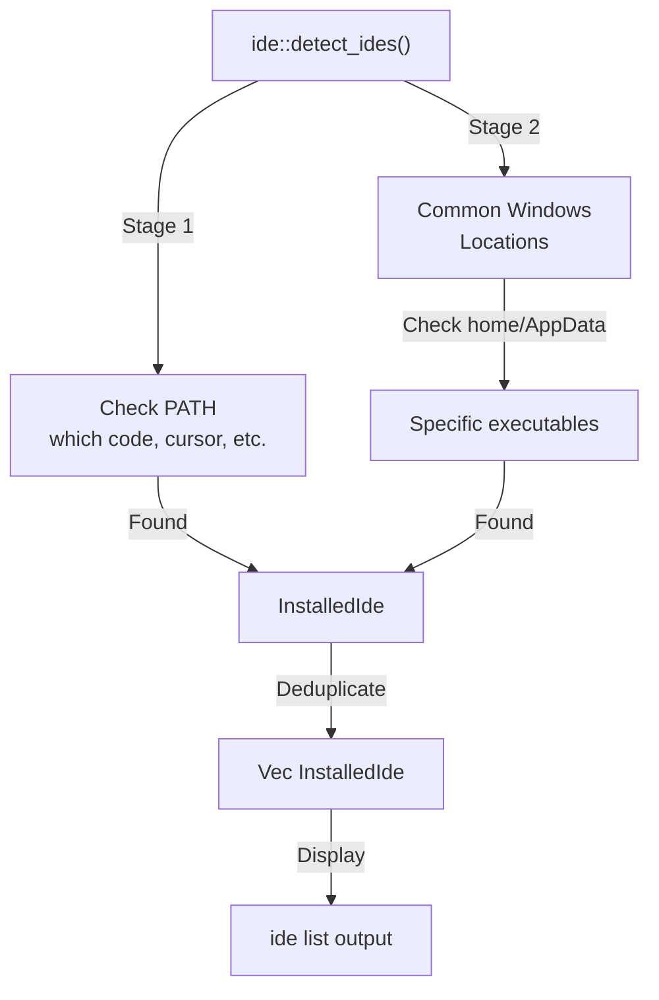
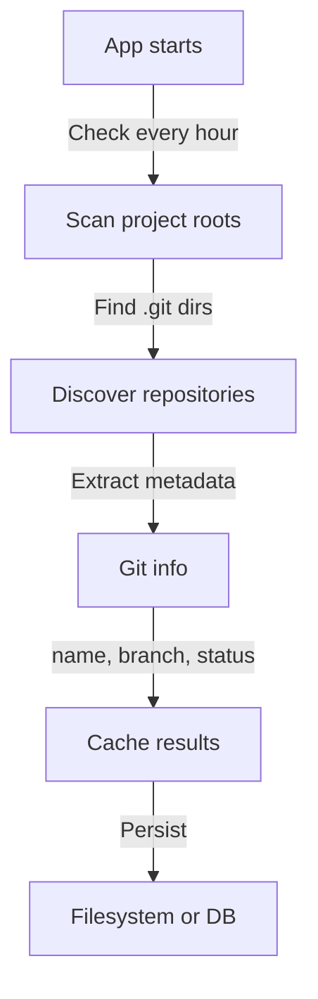

# Architecture

This document describes the architecture of `dev-cli`, including its layers, module organization, and design decisions.

---

## Table of Contents

1. [High-Level Architecture](#high-level-architecture)
2. [Layered Architecture](#layered-architecture)
3. [Module Organization](#module-organization)
4. [Command Dispatch](#command-dispatch)
5. [Data Flow](#data-flow)
6. [IDE Detection Pipeline](#ide-detection-pipeline)
7. [Configuration Lifecycle](#configuration-lifecycle)
8. [Type Glossary](#type-glossary)
9. [Future Architecture](#future-architecture)
10. [Design Decisions](#design-decisions)

---

## High-Level Architecture



---

## Layered Architecture

`dev-cli` follows a classic layered architecture pattern:

### Layer 1: CLI Layer

**Files:** `src/cli.rs`

**Responsibility:** Parse user input and validate arguments.

**Characteristics:**
- Uses Clap's derive macros for ergonomic argument parsing
- Defines all top-level commands and their arguments
- Performs no business logic (except parsing)
- Converts raw arguments into structured enums and structs

**Key Types:**
- `Cli` — top-level command parser
- `Commands` — enum of all available commands
- `ProjectCommand`, `ConfigCommand`, `IdeCommand` — subcommand groups

### Layer 2: Command Layer

**Files:** `src/commands/*.rs`

**Responsibility:** Implement command handlers; orchestrate services.

**Characteristics:**
- Each command module (`project.rs`, `config.rs`, etc.) handles its logic
- Calls service layer to perform work
- Formats output for terminal display
- Handles user-facing errors and messages

**Key Modules:**
- `commands::project` — launch and list projects
- `commands::config` — manage configuration
- `commands::ide` — list installed IDEs
- `commands::install` — installation command

### Layer 3: Service Layer

**Files:** `src/config.rs`, `src/ide/`, `src/installer.rs`, `src/scanner.rs`

**Responsibility:** Implement business logic and system interaction.

**Characteristics:**
- Configuration management and persistence
- IDE detection and launching
- Repository scanning (future)
- Installation logic

**Key Types:**
- `Config` — TOML-based configuration with serde
- `InstalledIde` — detected IDE with name and path
- IDE detection functions — Windows registry, PATH, common locations

### Layer 4: Model Layer

**Files:** `src/models/*.rs`

**Responsibility:** Define data structures for the application.

**Characteristics:**
- Minimal logic; primarily data structures
- Derives for serialization, cloning, and CLI integration
- No dependencies on services

**Key Types:**
- `Ide` enum — supported IDEs with ValueEnum for CLI
- `Project` — metadata about a Git project (future)

---

## Module Organization

```
src/
├── main.rs              # Entry point; dispatches to commands
│
├── cli.rs               # CLI parsing (Clap derive)
│                        # Defines: Cli, Commands, *Command, *Args
│
├── commands/
│   ├── mod.rs           # Module definition
│   ├── project.rs       # Handle: project list, project open
│   ├── config.rs        # Handle: config show, config init
│   ├── ide.rs           # Handle: ide list
│   └── install.rs       # Handle: install
│
├── config.rs            # Config loading, saving, schema
│                        # Type: Config
│
├── ide/
│   ├── mod.rs           # IDE subsystem coordinator
│   ├── detect.rs        # IDE discovery algorithm
│   ├── launcher.rs      # Process spawning
│   └── registry.rs      # InstalledIde type
│
├── models/
│   ├── mod.rs           # Module definition
│   ├── ide.rs           # Ide enum
│   └── project.rs       # Project type (placeholder)
│
├── installer.rs         # Installation logic
│
└── scanner.rs           # Repository discovery (placeholder)
```

### Dependency Direction

```
main.rs
  ↓
cli.rs ← commands/* ← config.rs, ide/*, installer.rs, scanner.rs
  ↓                     ↓
commands/*          models/*
  ↓                     ↑
config.rs ←────────────┘
ide/* ←─────────────────┘
installer.rs
scanner.rs
```

**Rule:** Dependencies flow downward. No upward dependencies.

---

## Command Dispatch

The command dispatch flow handles user input:

```mermaid
sequenceDiagram
    User->>main.rs: cargo run -- config show
    main.rs->>Cli::parse(): Parse args
    Cli::parse()->>main.rs: Cli { command: Config(...) }
    main.rs->>commands/config.rs: execute(ConfigCommand)
    commands/config.rs->>Config::load(): Load config file
    Config::load()->>Filesystem: Read config.toml
    Filesystem->>Config::load(): TOML content
    Config::load()->>commands/config.rs: Config instance
    commands/config.rs->>User: Display config
```

**Steps:**

1. **Parse** — `Cli::parse()` from terminal arguments
2. **Match** — `main.rs` pattern matches on `Commands` enum
3. **Dispatch** — Calls appropriate command executor
4. **Execute** — Command orchestrates services
5. **Output** — Results formatted for terminal
6. **Return** — `Result<()>` propagates errors

---

## Data Flow

### Project Open Flow



---

## IDE Detection Pipeline

IDE detection follows a multi-stage strategy:



**Detection Stages:**

1. **CLI Executables** — Use `which` crate to find commands in PATH
   - `code` → VS Code
   - `cursor` → Cursor
   - `claude` → Claude Code
   - `wt` → Windows Terminal

2. **Windows Common Locations** — Check standard installation paths
   - `C:\Program Files\Microsoft VS Code\bin\code.cmd`
   - `C:\Program Files\Cursor\Cursor.exe`
   - `C:\Users\{user}\.local\bin\claude.exe`

3. **Deduplication** — Remove duplicates if found in multiple locations

**Future Extensions:**
- Windows Registry scanning for IntelliJ, Rider, etc.
- macOS Application bundle detection
- Linux standard locations

---

## Configuration Lifecycle

Configuration follows a predictable lifecycle:

```mermaid
graph TD
    A["Application start"] -->|"Config::load()"| B{Config file exists?}
    B -->|Yes| C["Read file"]
    C -->|TOML| D["Deserialize with Serde"]
    D -->|Config struct| E["Use config"]
    B -->|No| F["Create default"]
    F -->|Default::default()| G["Save to disk"]
    G -->|"Write TOML"| H["Filesystem"]
    H -->|File created| E
```

**Default Configuration:**

```toml
projects_root = ["~/Projects"]
default_ide = "vscode"
```

**Configuration Location:**
- **Linux/macOS:** `~/.config/dev-cli/config.toml`
- **Windows:** `C:\Users\{user}\AppData\Local\dev-cli\config\config.toml`

(Uses `directories` crate for platform-aware paths)

---

## Type Glossary

### Core Types

| Type | Module | Purpose |
|------|--------|---------|
| `Cli` | `cli.rs` | Top-level command struct from Clap |
| `Commands` | `cli.rs` | Enum of all available commands |
| `Config` | `config.rs` | User configuration (TOML) |
| `Ide` | `models/ide.rs` | Enum of supported IDEs |
| `Project` | `models/project.rs` | Project metadata (placeholder) |
| `InstalledIde` | `ide/registry.rs` | Detected IDE with executable path |
| `ProjectCommand` | `cli.rs` | Parsed project subcommand args |
| `ConfigCommand` | `cli.rs` | Parsed config subcommand args |
| `IdeCommand` | `cli.rs` | Parsed ide subcommand args |
| `OpenArgs` | `cli.rs` | Parsed open command arguments |

### Important Traits and Derives

| Trait | Usage |
|-------|-------|
| `Parser` | Enables Clap derive macro on `Cli` |
| `Subcommand` | Enables subcommand parsing |
| `Args` | Enables argument struct parsing |
| `ValueEnum` | Enables `Ide` to be parsed from CLI strings |
| `Serialize` / `Deserialize` | Enables TOML serialization via Serde |
| `Debug`, `Clone`, `Copy` | Standard derives for convenience |

---

## Future Architecture

### Sprint 2: Repository Scanner

The `scanner.rs` module will implement automatic repository discovery:



### Sprint 3-4: Git Engine

Add Git-aware features:
- Show current branch for each project
- Display uncommitted changes
- List recent commits
- Filter projects by branch

### Sprint 4+: Dashboard & TUI

Interactive terminal UI:
- Browse projects with arrow keys
- Preview project status
- Open project with Enter
- Search and filter in real-time

**Architecture implications:**
- Use `crossterm` or `termion` for terminal control
- Add event loop for key handling
- Separate UI layer from business logic

---

## Design Decisions

### Why Clap Derive Macros?

**Decision:** Use Clap's `#[derive(Parser)]` instead of builder API.

**Rationale:**
- Declarative, easy to read and understand
- Compile-time validation
- Automatic `--help` and `--version`
- Reduces boilerplate

### Why TOML Configuration?

**Decision:** Use TOML with Serde instead of JSON or custom format.

**Rationale:**
- Human-readable for configuration files
- Type-safe with Serde deserialization
- Familiar format (like `Cargo.toml`)
- Good tooling support

### Why Multiple IDE Detection Stages?

**Decision:** Combine PATH lookup with common installation paths.

**Rationale:**
- PATH lookup works for CLI installs (most reliable)
- Common paths handle standard installers
- Fallback strategy ensures better detection
- Future registry scanning for package managers

### Why No Executable Caching in Config?

**Decision:** Always detect IDEs at runtime, don't store paths in config.

**Rationale:**
- Executables may move or be uninstalled
- Fresh detection is fast (milliseconds)
- Reduces configuration complexity
- Better user experience (auto-discovers new IDEs)

### Why Layered Architecture?

**Decision:** Use clear layer separation (CLI → Commands → Services → Models).

**Rationale:**
- **Testability** — Services can be tested independently
- **Maintainability** — Changes in one layer don't ripple up
- **Future growth** — Easy to add new layers (UI, API, etc.)
- **Clarity** — Clear responsibility boundaries

### Why Rust?

**Decision:** Implement in Rust instead of Python or Go.

**Rationale:**
- Fast startup time (important for CLI)
- Strong type system prevents runtime errors
- Excellent ecosystem (Clap, Serde, Tokio)
- Learning project for Rust skills
- Single static binary (easy distribution)

---

## Error Handling Strategy

`dev-cli` uses `anyhow::Result<T>` throughout:

```rust
fn main() -> Result<()> {
    // All functions return Result<T>
    let cli = Cli::parse();
    match cli.command {
        Commands::Project(cmd) => commands::project::execute(cmd)?,
        // ...
    }
    Ok(())
}
```

**Benefits:**
- Simple error propagation with `?`
- Automatic error context chaining
- User-friendly error messages
- No unwrapping in production code

**Error Flow:**
```
Low-level error (file not found)
  ↓
anyhow::context("Could not read config")
  ↓
Propagates to main with `?`
  ↓
Rust shows full error chain to user
```

---

## Testing Strategy

### Unit Tests

Small, focused tests for individual functions and types.

**Location:** Tests within source files, marked with `#[cfg(test)]`

### Integration Tests

Full end-to-end command testing using `assert_cmd`.

**Location:** `tests/cli_*.rs` files

**Examples:**
- `tests/cli_config.rs` — Tests `dev config` commands
- `tests/cli_ide.rs` — Tests `dev ide list`
- `tests/cli_open.rs` — Tests `dev open` scenarios

**Strategy:**
- Spawn CLI as subprocess
- Verify stdout/stderr with predicates
- Use temporary directories for config files
- No network access required

---

## Performance Characteristics

| Operation | Typical Time | Notes |
|-----------|--------------|-------|
| CLI startup | < 50ms | Minimal parsing and I/O |
| IDE detection | 10-100ms | Depends on PATH scan |
| Project open | 200-500ms | Mostly external IDE startup |
| Config load | 1-5ms | Single file read + TOML parse |
| Config save | 1-5ms | Single file write |

**Bottlenecks:**
- External IDE launch time (not in our control)
- Filesystem operations (cached when possible)

---

## Compatibility

| Aspect | Support | Notes |
|--------|---------|-------|
| **OS** | Windows, macOS, Linux | Primary focus: Windows |
| **Rust** | 1.70+ | Uses stable features only |
| **IDEs** | VS Code, Cursor, Claude Code, Windows Terminal, IntelliJ (planned), Rider (planned), Zed (planned) | Extensible enum |
| **Shells** | All (PowerShell, Bash, Zsh, etc.) | Pure CLI, no shell integration |

---

## See Also

- [CONTRIBUTING.md](CONTRIBUTING.md) — Development workflow
- [docs/project-structure.md](docs/project-structure.md) — File-by-file breakdown
- [docs/cli-design.md](docs/cli-design.md) — CLI parser details
- [docs/rust-for-dev-cli.md](docs/rust-for-dev-cli.md) — Rust patterns used
