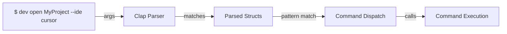

# CLI Design

How `dev-cli` parses and dispatches commands.

---

## Overview

The CLI is built on **Clap** — a popular Rust command-line argument parser that uses derive macros to define commands declaratively.



---

## Command Structure

### Top Level: `Cli`

```rust
#[derive(Parser)]
#[command(name = "dev")]
#[command(version)]
#[command(about = "Modern Git Project Manager")]
pub struct Cli {
    #[command(subcommand)]
    pub command: Commands,
}
```

**What it does:**
- Parses the top-level command
- Defines app name, version, and help text
- Points to subcommands via `Commands` enum

**Clap Attributes:**
- `#[derive(Parser)]` — Enable Clap derive macro
- `#[command(...)]` — Define command properties
- `#[command(subcommand)]` — Indicate this field holds subcommands

### Subcommands: `Commands`

```rust
#[derive(Subcommand)]
pub enum Commands {
    Project(ProjectCommand),
    Config(ConfigCommand),
    Ide(IdeCommand),
    Install,
    Open(OpenArgs),
}
```

**What it does:**
- Defines all top-level commands
- `Project(ProjectCommand)` — command with args
- `Install` — simple flag (no additional args)
- `Open(OpenArgs)` — command with args (shorthand for `dev project open`)

### Command Arguments

```rust
#[derive(Args)]
pub struct ProjectCommand {
    #[command(subcommand)]
    pub command: ProjectSubcommand,
}

#[derive(Subcommand)]
pub enum ProjectSubcommand {
    List,
    Open(OpenArgs),
}

#[derive(Args)]
pub struct OpenArgs {
    pub project: String,

    #[arg(short, long)]
    pub ide: Option<Ide>,
}
```

**What it does:**
- `ProjectCommand` groups all project-related args
- `ProjectSubcommand` defines `list` and `open` variants
- `OpenArgs` defines the arguments for opening a project
  - Positional: `project` (required string)
  - Optional: `--ide` or `-i` (optional Ide enum)

### Ide Enum with ValueEnum

```rust
#[derive(Debug, Clone, Copy, ValueEnum)]
pub enum Ide {
    Cursor,
    Vscode,
    Claude,
    Terminal,
    Idea,
    Rider,
    Zed,
}
```

**What it does:**
- `#[derive(ValueEnum)]` lets Clap parse strings to enum variants
- `"cursor"` on CLI → `Ide::Cursor`
- `"vscode"` on CLI → `Ide::Vscode`
- etc.

---

## Parsing Flow

### Step 1: User Types Command

```bash
$ dev project open MyProject --ide cursor
```

### Step 2: Clap Parses Args

```rust
let cli = Cli::parse();
```

Clap automatically:
- Reads command-line arguments from `std::env::args()`
- Matches them against the struct definitions
- Creates nested struct instances

### Step 3: Parsed Structure

```rust
Cli {
    command: Commands::Project(
        ProjectCommand {
            command: ProjectSubcommand::Open(
                OpenArgs {
                    project: "MyProject".to_string(),
                    ide: Some(Ide::Cursor),
                }
            )
        }
    )
}
```

### Step 4: Main Dispatcher

In `src/main.rs`:

```rust
fn main() -> Result<()> {
    let cli = Cli::parse();

    match cli.command {
        Commands::Project(cmd) => commands::project::execute(cmd)?,
        Commands::Config(cmd) => commands::config::execute(cmd)?,
        Commands::Ide(cmd) => commands::ide::execute(cmd)?,
        Commands::Install => commands::install::execute()?,
        Commands::Open(args) => commands::project::open_shortcut(args)?,
    }

    Ok(())
}
```

Pattern matches on `Commands` enum and dispatches to appropriate handler.

### Step 5: Command Handler

In `src/commands/project.rs`:

```rust
pub fn execute(cmd: ProjectCommand) -> Result<()> {
    match cmd.command {
        ProjectSubcommand::List => list(),
        ProjectSubcommand::Open(args) => open(args),
    }
}

fn open(args: OpenArgs) -> Result<()> {
    let config = Config::load()?;

    for root in config.projects_root {
        let candidate = root.join(&args.project);

        if candidate.exists() {
            let ide = args.ide.unwrap_or(config.default_ide);
            launcher::launch(ide, &candidate)?;
            println!("{} {}", "Opened".green(), candidate.display());
            return Ok(());
        }
    }

    bail!("Project '{}' not found.", args.project)
}
```

Handler receives parsed args and executes business logic.

---

## Command Examples

### `dev project list`

```bash
$ dev project list
```

**Parsing:**
```
Commands::Project(ProjectCommand {
    command: ProjectSubcommand::List
})
```

**Dispatch:** `commands::project::execute()` → `list()`

### `dev open MyProject`

```bash
$ dev open MyProject
```

**Parsing:**
```
Commands::Open(OpenArgs {
    project: "MyProject",
    ide: None
})
```

**Dispatch:** `commands::project::open_shortcut()`

### `dev open MyProject --ide cursor`

```bash
$ dev open MyProject --ide cursor
```

**Parsing:**
```
Commands::Open(OpenArgs {
    project: "MyProject",
    ide: Some(Ide::Cursor)
})
```

**Dispatch:** `commands::project::open_shortcut()`

### `dev config show`

```bash
$ dev config show
```

**Parsing:**
```
Commands::Config(ConfigCommand {
    command: ConfigSubcommand::Show
})
```

**Dispatch:** `commands::config::execute()`

### `dev config set-default-ide vscode`

```bash
$ dev config set-default-ide vscode
```

**Parsing:**
```
Commands::Config(ConfigCommand {
    command: ConfigSubcommand::SetDefaultIde {
        ide: Ide::Vscode
    }
})
```

**Dispatch:** `commands::config::execute()`

### `dev ide list`

```bash
$ dev ide list
```

**Parsing:**
```
Commands::Ide(IdeCommand {
    command: IdeSubcommand::List
})
```

**Dispatch:** `commands::ide::execute()`

### `dev install`

```bash
$ dev install
```

**Parsing:**
```
Commands::Install
```

**Dispatch:** `commands::install::execute()`

### `dev --help`

```bash
$ dev --help
```

**Clap automatically generates:**
```
Modern Git Project Manager

Usage: dev <COMMAND>

Commands:
  project   
  config    
  ide       
  install   
  open      
  help      Print this message or the help of a given subcommand(s)

Options:
  -h, --help     Print help
  -V, --version  Print version
```

### `dev project --help`

```bash
$ dev project --help
```

**Clap automatically generates:**
```
Usage: dev project <COMMAND>

Commands:
  list  
  open  
  help  Print this message or the help of a given subcommand(s)

Options:
  -h, --help  Print help
```

### `dev open --help`

```bash
$ dev open --help
```

**Clap automatically generates:**
```
Usage: dev open <PROJECT> [OPTIONS]

Arguments:
  <PROJECT>  

Options:
  -i, --ide <IDE>  
  -h, --help       Print help
```

---

## Clap Attributes Reference

### Struct Attributes

| Attribute | Purpose |
|-----------|---------|
| `#[derive(Parser)]` | Enable CLI parsing |
| `#[command(name = "dev")]` | App name |
| `#[command(version)]` | Enable `--version` |
| `#[command(about = "...")]` | One-line description |
| `#[command(subcommand)]` | Field contains subcommands |

### Field Attributes

| Attribute | Purpose |
|-----------|---------|
| `#[command(subcommand)]` | Field is a subcommand |
| `#[arg(short)]` | Enable short flag (e.g., `-i`) |
| `#[arg(long)]` | Enable long flag (e.g., `--ide`) |
| `#[arg(short, long)]` | Both short and long |
| `#[arg(required = true)]` | Make argument required |
| `#[arg(help = "...")]` | Help text |

### Enum Attributes

| Attribute | Purpose |
|-----------|---------|
| `#[derive(Subcommand)]` | Enum represents subcommands |
| `#[derive(ValueEnum)]` | Enum represents CLI values |

---

## Argument Types

Clap automatically parses to these types:

| Type | Parsing | Examples |
|------|---------|----------|
| `String` | As-is | `"hello"`, `"my-project"` |
| `Option<T>` | Optional argument | `Some(value)` or `None` |
| `Vec<T>` | Multiple values | `["a", "b", "c"]` |
| `Enum` with `ValueEnum` | String to variant | `"cursor"` → `Ide::Cursor` |
| Numbers | Parsed from string | `"42"` → `42` |

---

## Error Handling

### Parsing Errors

If argument is invalid:

```bash
$ dev open --ide invalid-ide
error: 'invalid-ide' isn't a valid value for '--ide'

  [possible values: cursor, vscode, claude, terminal, idea, rider, zed]
```

Clap automatically generates validation errors.

### Missing Required Arguments

```bash
$ dev open
error: the following required arguments were not provided:
  <PROJECT>

Usage: dev open <PROJECT>
```

Clap requires all positional arguments without defaults.

### Custom Validation

Currently not implemented in `dev-cli`, but Clap supports:

```rust
#[arg(value_parser = my_validator)]
pub project: String,

fn my_validator(s: &str) -> Result<String, String> {
    if s.len() > 0 {
        Ok(s.to_string())
    } else {
        Err("project name cannot be empty".to_string())
    }
}
```

---

## Comparison with Other Approaches

### Clap Derive (Current)

```rust
#[derive(Parser)]
pub struct Cli {
    #[command(subcommand)]
    pub command: Commands,
}
```

**Pros:**
- Declarative, easy to read
- Type-safe
- Automatic help/version
- Minimal boilerplate

**Cons:**
- Limited customization
- Compile-time defined structure

### Clap Builder API

```rust
use clap::{App, Arg};

let app = App::new("dev")
    .version("0.1.0")
    .about("Modern Git Project Manager")
    .subcommand(
        App::new("open")
            .arg(Arg::new("project").required(true))
    );
```

**Pros:**
- Maximum flexibility
- Runtime configurable

**Cons:**
- Verbose
- Runtime errors possible
- Harder to read

### Structopt (Predecessor)

Structopt was the predecessor to Clap derive. Clap now includes derive natively.

---

## Future Enhancements

### Validation

Could add project name validation:

```rust
#[derive(Args)]
pub struct OpenArgs {
    #[arg(value_parser = valid_project_name)]
    pub project: String,
}

fn valid_project_name(s: &str) -> Result<String, String> {
    if s.chars().all(|c| c.is_alphanumeric() || c == '-' || c == '_') {
        Ok(s.to_string())
    } else {
        Err("Invalid project name".to_string())
    }
}
```

### Custom Help

Could customize help output with templates (advanced Clap feature).

### Shell Completions

Could generate shell completions for bash/zsh:

```bash
$ dev --generate bash > /etc/bash_completion.d/dev
```

---

## See Also

- [Clap Documentation](https://docs.rs/clap/latest/clap/)
- [ARCHITECTURE.md](../ARCHITECTURE.md) — System design
- [docs/project-structure.md](project-structure.md) — File reference
- [src/cli.rs](../src/cli.rs) — Actual CLI definitions
