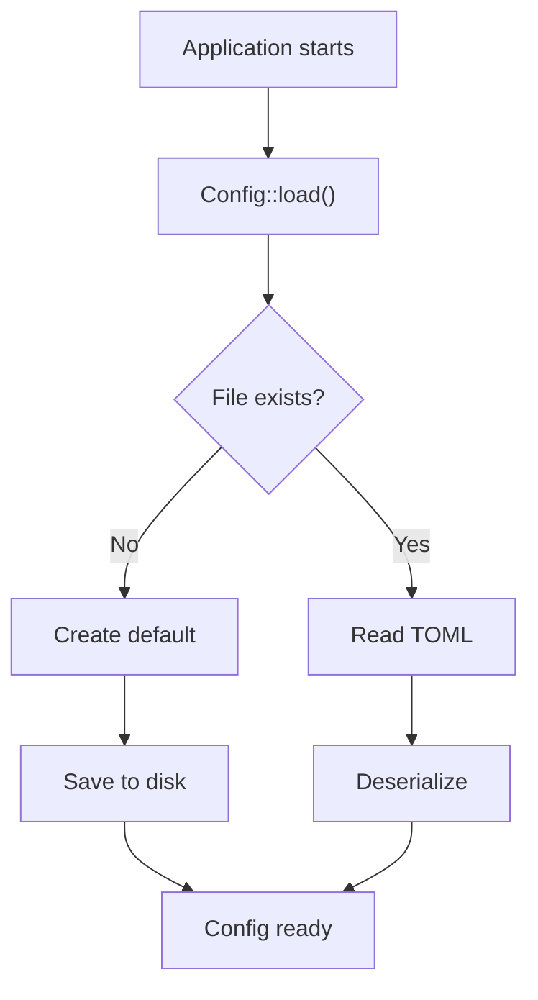

# Configuration

How `dev-cli` stores and manages configuration.

---

## Overview

Configuration is stored in a TOML file at a platform-specific location. The file is automatically created on first run with sensible defaults.



---

## Configuration Location

Configuration file is stored at **platform-aware locations**:

| Platform | Location |
|----------|----------|
| Windows | `C:\Users\{user}\AppData\Local\dev-cli\config\config.toml` |
| macOS | `~/.config/dev-cli/config.toml` |
| Linux | `~/.config/dev-cli/config.toml` |

### How It's Determined

Uses the `directories` crate:

```rust
use directories::ProjectDirs;

let proj = ProjectDirs::from("", "", "dev-cli")?;
let config_dir = proj.config_dir();  // Platform-specific
let config_path = config_dir.join("config.toml");
```

The `ProjectDirs::from("", "", "dev-cli")` uses:
- First arg: "qualifier" (often reverse domain, empty here)
- Second arg: "organization" (company name, empty here)
- Third arg: "project_name" (our app name)

---

## Configuration File Format

### Default Configuration

```toml
projects_root = ["/Users/parth/Projects"]
default_ide = "vscode"
```

### Schema

```toml
# List of directories to search for projects
# Each directory can contain multiple Git repositories
projects_root = [
    "C:/Users/parth/Projects",
    "C:/Users/parth/Work",
    "C:/Users/parth/Side"
]

# Default IDE for opening projects
# Must be one of: vscode, cursor, claude, terminal, idea, rider, zed
default_ide = "cursor"
```

### Details

**`projects_root`** (required)
- Type: Array of paths (strings)
- Default: `["~/Projects"]`
- Behavior: `dev open <project>` searches these directories
- Example:
  ```toml
  projects_root = [
      "C:/Users/user/Projects",
      "D:/dev/work"
  ]
  ```

**`default_ide`** (required)
- Type: String (IDE identifier)
- Default: `"vscode"`
- Valid values: `"vscode"`, `"cursor"`, `"claude"`, `"terminal"`, `"idea"`, `"rider"`, `"zed"`
- Behavior: Used when opening projects without `--ide` flag
- Example:
  ```toml
  default_ide = "cursor"
  ```

---

## Configuration Lifecycle

### 1. First Run

User runs `dev` for the first time:

```bash
$ dev config show
```

**What happens:**
1. Application calls `Config::load()`
2. File doesn't exist
3. Loads `Config::default()`
4. Saves to disk with `config.save()`
5. Returns config to caller

**Result:**
- Config file created at platform-specific location
- Configuration with defaults is ready

### 2. Loading Existing Config

User runs `dev` again:

```bash
$ dev config show
```

**What happens:**
1. `Config::load()` checks if file exists
2. File is found
3. Reads and parses TOML
4. Deserializes to `Config` struct
5. Returns config

**Result:**
- Existing configuration is used

### 3. Modifying Config

User changes default IDE:

```bash
$ dev config set-default-ide cursor
```

**What happens:**
1. Loads current config
2. Modifies `default_ide` field
3. Calls `config.save()`
4. TOML is written to disk

**Result:**
- Changes are persisted

---

## Serialization with Serde

### The Config Type

```rust
#[derive(Debug, Serialize, Deserialize)]
pub struct Config {
    pub projects_root: Vec<PathBuf>,
    pub default_ide: Ide,
}
```

**Derives:**
- `Debug` — Printable for debugging
- `Serialize` — Can be written to TOML
- `Deserialize` — Can be loaded from TOML

### Saving to TOML

```rust
impl Config {
    pub fn save(&self) -> Result<()> {
        let path = Self::path()?;

        if let Some(parent) = path.parent() {
            fs::create_dir_all(parent)?;
        }

        fs::write(path, toml::to_string_pretty(self)?)?;

        Ok(())
    }
}
```

**Steps:**
1. Get config path (platform-specific)
2. Create parent directories if needed
3. Serialize `self` to pretty TOML string
4. Write to disk

### Loading from TOML

```rust
impl Config {
    pub fn load() -> Result<Self> {
        let path = Self::path()?;

        if !path.exists() {
            let config = Self::default();
            config.save()?;
            return Ok(config);
        }

        let text = fs::read_to_string(path)?;
        Ok(toml::from_str(&text)?)
    }
}
```

**Steps:**
1. Get config path
2. If file doesn't exist, create default and save
3. Read file as string
4. Deserialize TOML string to `Config` struct
5. Return config

---

## Default Configuration

```rust
impl Default for Config {
    fn default() -> Self {
        let home = BaseDirs::new()
            .expect("Couldn't find home directory")
            .home_dir()
            .to_path_buf();

        Self {
            projects_root: vec![home.join("Projects")],
            default_ide: Ide::Vscode,
        }
    }
}
```

**Default behavior:**
- Projects root: `~/Projects` (user's home directory)
- Default IDE: `vscode`

**Used when:**
- Configuration file doesn't exist
- User runs `dev config init`

---

## Configuration Usage Examples

### Example 1: Default Configuration

User hasn't configured anything. First run:

```bash
$ dev config show
projects_root = ["/home/alice/Projects"]
default_ide = "vscode"

$ dev open MyProject
# Opens MyProject in VS Code (default)
```

### Example 2: Multiple Project Roots

User has projects in multiple locations:

```toml
# ~/.config/dev-cli/config.toml
projects_root = [
    "/home/alice/Projects",
    "/home/alice/Work",
    "/mnt/external/Side"
]
default_ide = "cursor"
```

Now `dev open` searches all three directories:

```bash
$ dev open ProjectInWork
# Finds /home/alice/Work/ProjectInWork
# Opens in Cursor (default)
```

### Example 3: Overriding Default IDE

User prefers Cursor but occasionally wants VS Code:

```bash
$ dev open MyProject
# Opens in Cursor (configured default)

$ dev open MyProject --ide vscode
# Opens in VS Code (overrides default)
```

---

## Migration & Versioning

### Current Strategy

Configuration file has **no version field**. Future versions will need a migration strategy.

### Proposed Future Approach

When adding a new configuration field:

```rust
#[derive(Debug, Serialize, Deserialize)]
pub struct Config {
    pub projects_root: Vec<PathBuf>,
    pub default_ide: Ide,
    
    // New in future version
    #[serde(default)]
    pub enable_auto_discovery: bool,
}
```

**How it works:**
- Old config files don't have `enable_auto_discovery`
- `#[serde(default)]` uses `bool::default()` (which is `false`)
- New field seamlessly added without breaking old configs

### Handling Major Changes

For incompatible changes:
1. Create new config type (e.g., `ConfigV2`)
2. Add migration logic in `load()`
3. Convert old format to new format
4. Save as new version

Example:
```rust
pub fn load() -> Result<Self> {
    let path = Self::path()?;
    
    if !path.exists() {
        let config = Self::default();
        config.save()?;
        return Ok(config);
    }

    let text = fs::read_to_string(path)?;
    
    // Try new format first
    if let Ok(config) = toml::from_str::<ConfigV2>(&text) {
        return Ok(config.into());  // Convert to current version
    }
    
    // Fall back to old format
    let old: ConfigV1 = toml::from_str(&text)?;
    let config = Self::from(old);
    config.save()?;  // Update to new format
    Ok(config)
}
```

---

## Directories Crate

The `directories` crate provides platform-specific paths:

```rust
use directories::ProjectDirs;

let proj = ProjectDirs::from("", "", "dev-cli")?;

println!("{}", proj.config_dir());      // Config directory
println!("{}", proj.cache_dir());       // Cache directory
println!("{}", proj.data_dir());        // Data directory
println!("{}", proj.preference_dir());  // Preferences directory
```

### Why Use It?

**Without `directories` crate:**
```rust
// Hard-coded paths (bad!)
#[cfg(target_os = "windows")]
fn config_path() -> PathBuf {
    // C:\Users\{user}\AppData\Local\dev-cli\config\config.toml
}

#[cfg(target_os = "macos")]
fn config_path() -> PathBuf {
    // ~/Library/Application Support/dev-cli/config.toml
}

#[cfg(target_os = "linux")]
fn config_path() -> PathBuf {
    // ~/.config/dev-cli/config.toml
}
```

**With `directories` crate:**
```rust
fn config_path() -> PathBuf {
    ProjectDirs::from("", "", "dev-cli")?
        .config_dir()
        .join("config.toml")
}
// Works on all platforms!
```

---

## Editing Configuration

### Via Config File

Edit directly with a text editor:

```bash
# Find the file
$ cd ~/.config/dev-cli  # On Linux/macOS
$ cd C:\Users\{user}\AppData\Local\dev-cli\config  # On Windows

# Edit in your editor
$ nano config.toml
$ vim config.toml
$ code config.toml
```

### Via Commands

Use `dev` commands to modify:

```bash
# View current configuration
$ dev config show

# Update default IDE
$ dev config set-default-ide cursor

# Reset to defaults
$ rm ~/.config/dev-cli/config.toml
$ dev config init
```

---

## Validation

Currently minimal validation. Future improvements:

```rust
impl Config {
    pub fn validate(&self) -> Result<()> {
        // Check paths exist
        for path in &self.projects_root {
            if !path.exists() {
                println!("Warning: {} does not exist", path.display());
            }
        }
        
        // Could validate more...
        Ok(())
    }
}
```

---

## Troubleshooting

### "Configuration file is not valid TOML"

**Problem:** Config file has syntax errors

**Solution:**
1. Open the config file
2. Validate TOML syntax (use online validator or `toml-cli`)
3. Fix syntax errors
4. Save and retry

### "Couldn't locate config directory"

**Problem:** `ProjectDirs::from()` failed

**Solution:**
1. Ensure you have a home directory
2. Check filesystem permissions
3. Try `dev config init` to recreate

### Configuration Changes Don't Apply

**Problem:** Changes don't take effect

**Solution:**
1. Ensure you saved the file
2. Close and reopen terminal
3. Run `dev config show` to verify changes
4. Check file location is correct

---

## See Also

- [Serde Documentation](https://serde.rs/)
- [TOML Specification](https://toml.io/)
- [directories Crate](https://docs.rs/directories/latest/directories/)
- [src/config.rs](../src/config.rs) — Configuration implementation
- [ARCHITECTURE.md](../ARCHITECTURE.md) — System design
