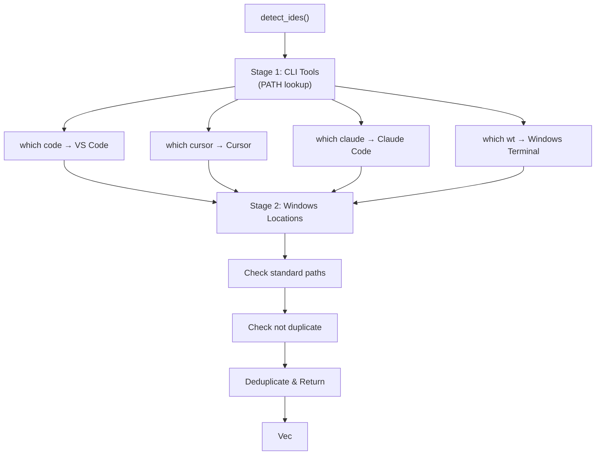

# IDE System

How `dev-cli` detects and launches IDEs.

---

## Overview

The IDE system consists of three parts:

1. **Detection** — Find installed IDEs on the system
2. **Registry** — Store information about detected IDEs
3. **Launcher** — Spawn IDE processes

```mermaid
graph LR
    Detect["IDE Detection<br/>(detect_ides)"]
    Registry["Registry<br/>(InstalledIde)"]
    Launcher["Launcher<br/>(launch IDE)"]
    
    Detect -->|Found| Registry
    Registry -->|Path + IDE| Launcher
    Launcher -->|spawn()| IDE["External IDE"]
```

---

## IDE Detection Algorithm

Detection happens in **stages** for reliability and performance:

### Stage 1: CLI Tool Detection (PATH)

Check if IDE is available as a command-line tool in PATH:

```rust
fn detect_cli(list: &mut Vec<InstalledIde>, ide: Ide, name: &str, cmd: &str) {
    if let Ok(path) = which(cmd) {
        list.push(InstalledIde::new(ide, name, path));
    }
}
```

**What it checks:**
- `which code` → Find VS Code CLI
- `which cursor` → Find Cursor CLI
- `which claude` → Find Claude Code CLI
- `which wt` → Find Windows Terminal CLI

**Advantages:**
- Fast (milliseconds)
- Works for CLI-installed tools
- Works with custom installation paths

**Limitations:**
- Only finds tools in PATH
- Misses graphical apps without CLI wrappers

### Stage 2: Common Windows Locations

Check standard Windows installation directories:

```rust
fn detect_common_windows_locations(list: &mut Vec<InstalledIde>) {
    let home = BaseDirs::new().unwrap().home_dir().to_path_buf();

    // Check VS Code
    let vscode = home.join("AppData/Local/Programs/Microsoft VS Code/bin/code.cmd");
    if vscode.exists() && !list.iter().any(|i| matches!(i.ide, Ide::Vscode)) {
        list.push(InstalledIde::new(Ide::Vscode, "VS Code", vscode));
    }

    // Check Cursor
    let cursor = home.join("AppData/Local/Programs/Cursor/Cursor.exe");
    if cursor.exists() {
        list.push(InstalledIde::new(Ide::Cursor, "Cursor", cursor));
    }

    // Check Claude Code
    let claude = home.join(".local/bin/claude.exe");
    if claude.exists() && !list.iter().any(|i| matches!(i.ide, Ide::Claude)) {
        list.push(InstalledIde::new(Ide::Claude, "Claude Code", claude));
    }
}
```

**What it checks:**
- `C:\Users\{user}\AppData\Local\Programs\Microsoft VS Code\bin\code.cmd` — VS Code
- `C:\Users\{user}\AppData\Local\Programs\Cursor\Cursor.exe` — Cursor
- `C:\Users\{user}\.local\bin\claude.exe` — Claude Code

**Advantages:**
- Catches graphical installers
- Works even without PATH setup

**Limitations:**
- Platform-specific (Windows-focused currently)
- Must know all common installation paths

### Stage 3: Deduplication

Remove duplicates if IDE found in both PATH and common locations:

```rust
if vscode.exists() && !list.iter().any(|i| matches!(i.ide, Ide::Vscode)) {
    // Only add if not already in list
}
```

---

## Full Detection Flow



---

## The InstalledIde Type

```rust
pub struct InstalledIde {
    pub ide: Ide,
    pub name: String,
    pub path: PathBuf,
}

impl InstalledIde {
    pub fn new(ide: Ide, name: &str, path: PathBuf) -> Self {
        Self {
            ide,
            name: name.to_string(),
            path,
        }
    }
}
```

**Fields:**
- `ide` — Which IDE (Vscode, Cursor, etc.)
- `name` — Display name (e.g., "VS Code", "Cursor")
- `path` — Full path to executable

**Example:**
```rust
InstalledIde {
    ide: Ide::Cursor,
    name: "Cursor",
    path: PathBuf::from("C:\\Program Files\\Cursor\\Cursor.exe"),
}
```

---

## IDE Launching

### The Launcher

```rust
pub fn launch(ide: Ide, path: &Path) -> Result<()> {
    let cmd = match ide {
        Ide::Vscode => "code",
        Ide::Cursor => "cursor",
        Ide::Claude => "claude",
        Ide::Terminal => "wt",
        // Future IDEs
        _ => return Err(anyhow::anyhow!("IDE not yet implemented")),
    };

    Command::new(cmd)
        .arg(path)
        .spawn()?
        .wait()?;

    Ok(())
}
```

**What it does:**
1. Maps IDE enum to command name
2. Creates new `Command` for the CLI tool
3. Adds project path as argument
4. Spawns the process
5. Waits for initial spawn (doesn't wait for IDE to close)

### Example Launch

```bash
$ dev open MyProject --ide cursor
```

**Execution:**
```rust
launcher::launch(Ide::Cursor, Path::new("C:\\Users\\parth\\Projects\\MyProject"))?;
```

**Spawns:**
```
cursor C:\Users\parth\Projects\MyProject
```

This opens the project in Cursor IDE.

---

## Supported IDEs

### Current (v0.1.0)

| IDE | Status | Detection |
|-----|--------|-----------|
| VS Code | ✅ Active | PATH + Windows locations |
| Cursor | ✅ Active | PATH + Windows locations |
| Claude Code | ✅ Active | PATH + Windows locations |
| Windows Terminal | ✅ Active | PATH |

### Planned

| IDE | Sprint | Detection Strategy |
|-----|--------|-------------------|
| IntelliJ IDEA | 2+ | Registry + common locations |
| JetBrains Rider | 2+ | Registry + common locations |
| Zed Editor | 3+ | Registry + common locations |
| Neovim | 4+ | PATH |
| Sublime Text | 4+ | Registry + common locations |

---

## Future Enhancements

### Windows Registry Detection

For IntelliJ and JetBrains tools:

```rust
use winreg::RegKey;

fn detect_jetbrains_ides() -> Vec<InstalledIde> {
    let hklm = RegKey::predef(HKEY_LOCAL_MACHINE);
    
    // Check registry for JetBrains applications
    if let Ok(key) = hklm.open_subkey("SOFTWARE\\JetBrains\\IntelliJ IDEA") {
        // Extract installation path from registry
        // Create InstalledIde instance
    }
    
    // Similar for Rider, CLion, etc.
}
```

### macOS Application Bundle Detection

```rust
fn detect_macos_apps() -> Vec<InstalledIde> {
    // Check /Applications directory
    for entry in fs::read_dir("/Applications")? {
        let path = entry?.path();
        
        if path.ends_with("Visual Studio Code.app") {
            // Found VS Code
        }
    }
}
```

### Linux Standard Locations

```rust
fn detect_linux_apps() -> Vec<InstalledIde> {
    let locations = vec![
        "/opt",
        "/usr/local/bin",
        "/snap/bin",
        &format!("{}/.local/bin", env::var("HOME").unwrap()),
    ];
    
    for loc in locations {
        // Scan for known IDE executables
    }
}
```

### IDE Configuration Profiles

Store IDE launch preferences:

```toml
[[ide_config.vscode]]
additional_args = ["--disable-extensions"]

[[ide_config.cursor]]
# Nothing extra
```

### Project-Specific IDE Override

Store preferred IDE per project:

```toml
# ~/.config/dev-cli/projects.toml
[projects.MyProject]
preferred_ide = "cursor"

[projects.LegacyProject]
preferred_ide = "vscode"
```

---

## Why Not Store Paths in Config?

### Question

Why not save IDE executable paths in `config.toml`?

```toml
# Why NOT this?
[ide_paths]
vscode = "C:\\Program Files\\Microsoft VS Code\\bin\\code.cmd"
cursor = "C:\\Program Files\\Cursor\\Cursor.exe"
```

### Answer

Because executables can **move, uninstall, or update**:

1. **User uninstalls IDE** → Stale path in config
2. **IDE updates to new location** → Path breaks
3. **IDE auto-updates** → Might change location
4. **Multiple installations** → Which one to use?
5. **Port to new machine** → Paths change

### Our Approach

**Always detect at runtime:**
- Fresh detection every invocation (milliseconds fast)
- Automatically finds new installations
- Automatically removes uninstalled IDEs
- No stale configuration

---

## Performance Characteristics

### Timing

| Operation | Time | Notes |
|-----------|------|-------|
| CLI detection (PATH scan) | 10-100ms | Fast, single pass |
| Windows location checks | 5-20ms | Filesystem checks only |
| Total detection | 20-150ms | Depends on PATH length |
| Full command execution | 200-500ms | Mostly IDE startup time |

### Optimization Opportunities

1. **Caching detection results** — Cache for 1 hour, then refresh
2. **Parallel detection** — Use `rayon` for parallel checks
3. **Lazy detection** — Only detect IDEs when `dev ide list` is called

Currently not optimized (not needed), but simple to add if performance becomes an issue.

---

## Troubleshooting

### IDE Not Detected

```bash
$ dev ide list
Installed IDEs:
✓ VS Code
```

But Cursor is installed!

**Causes:**
1. Cursor not in PATH
2. Cursor not in common Windows location
3. Custom installation location

**Solutions:**
```bash
# Add to PATH manually
set PATH=%PATH%;C:\Program Files\Cursor

# Or add to config.toml (future feature)
```

### IDE Detection Finds Duplicate

Example: VS Code found in both PATH and common location.

**Solution:** Automatic deduplication handles this:
```rust
if vscode.exists() && !list.iter().any(|i| matches!(i.ide, Ide::Vscode)) {
    // Already in list, don't add again
}
```

### IDE Doesn't Open Project

```bash
$ dev open MyProject --ide cursor
# Command executes but IDE doesn't open
```

**Causes:**
1. Project path doesn't exist
2. IDE executable path is wrong
3. IDE command format is wrong

**Debug:**
```bash
# Check project exists
$ dev project list

# Check IDEs detected
$ dev ide list

# Try IDE directly
$ cursor "C:\Users\user\Projects\MyProject"
```

---

## See Also

- [src/ide/](../src/ide/) — IDE system source code
- [docs/cli-design.md](cli-design.md) — CLI design
- [ARCHITECTURE.md](../ARCHITECTURE.md) — System architecture
- [CONTRIBUTING.md](../CONTRIBUTING.md) — Adding new features
